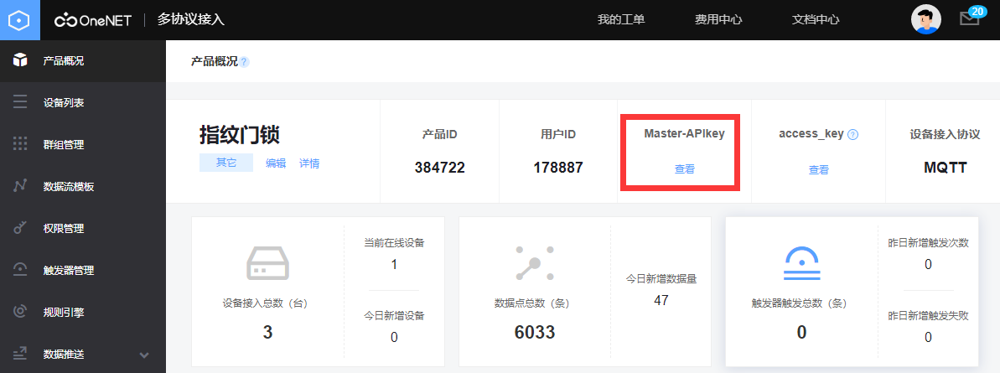
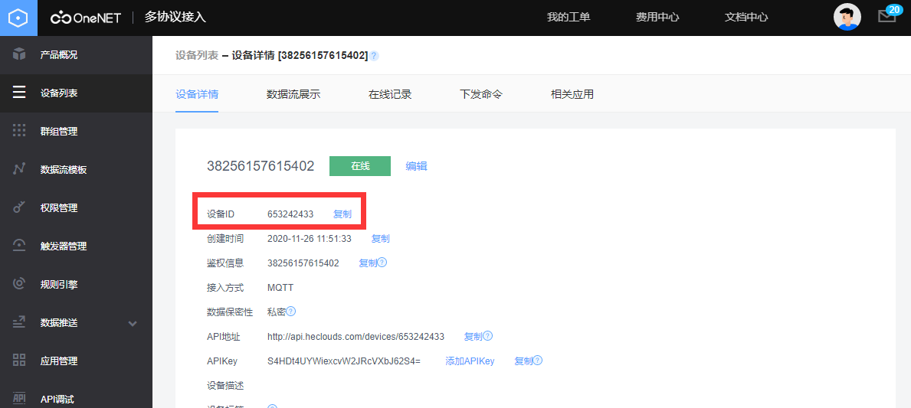
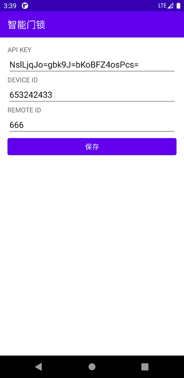
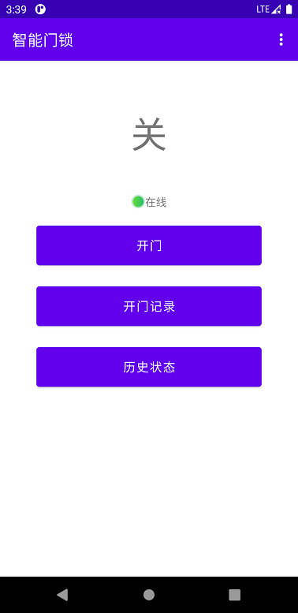
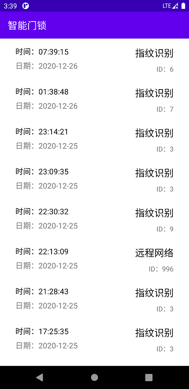
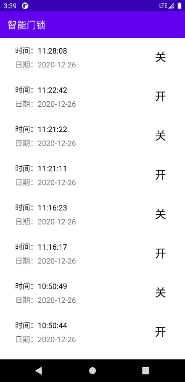

# W600-RT-Thread智能指纹门锁客户端

## 介绍


W600-RT-Thread智能指纹门锁配套安卓APP，项目基于OneNET SDK for Android进行开发的。
- **项目主仓库：https://gitee.com/hanxiaohu/W600-RT-Thread-door-lock**

>注：此项目只是简单的实现了控制开门和显示一些记录，如果需要其他功能或着其他平台客户端接入OneNET进行控制，请参考 [OneNET文档中心](https://open.iot.10086.cn/doc/multiprotocol) 

#### 软件架构
本项目使用了OneNET RESTful SDK for Android
```gradle
dependencies {
    implementation 'com.chinamobile.iot.onenet:onenet-sdk:2.2.1'
}
```

详细说明**请参考 [SDK wiki 文档](https://github.com/cm-heclouds/AndroidSDK/wiki)**

--- 

## 使用说明

### 获取连接参数
OneNET项目创建成功后需要获取二个参数
- Master-APIkey
- 设备ID





### 配置客户端
APIKEY和DEVICE ID填写前面从OneNET控制台获取到的值。REMOTE ID定义为用来记录开锁的ID



--- 

### 使用示例
#### 1.主界面
这里简单实现了显示门当前的状态和设备在线情况，点击开门按钮会通过OneNET下发指令实现开门



#### 2.开门记录

开门记录里显示了最近20次开门指令的时间、方式和ID



#### 3.历史状态

历史状态里显示了最近20次实际门的状态和发生状态变化的时间




